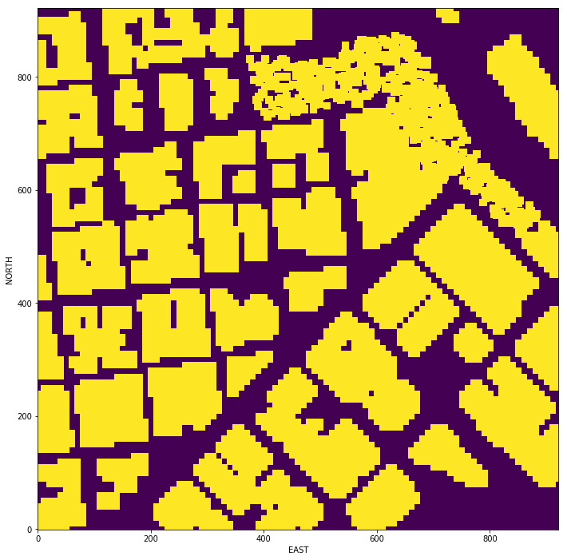
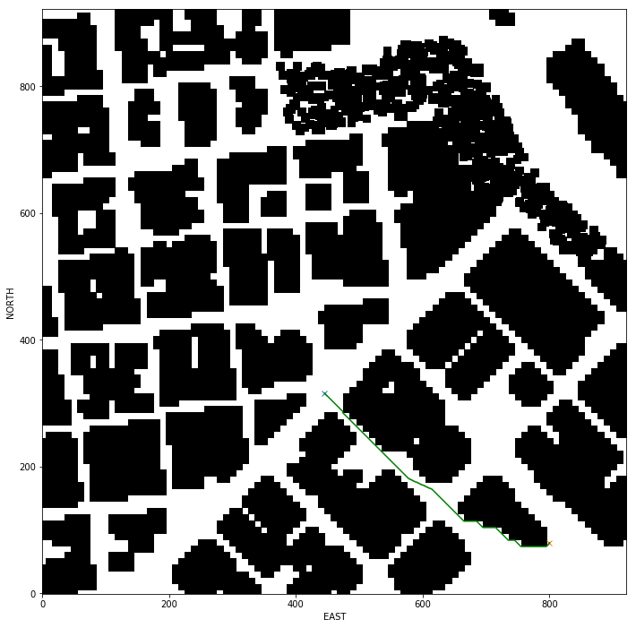
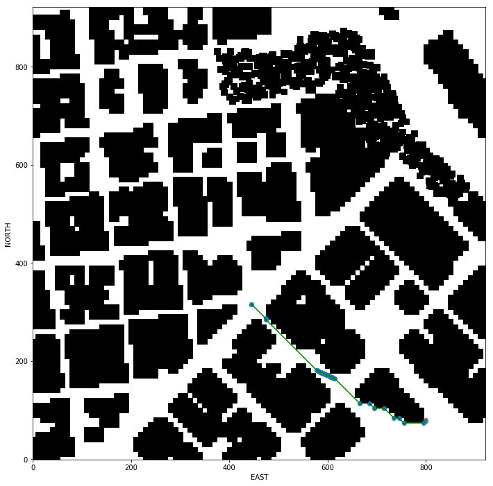

## Project: 3D Motion Planning

---

### Overview
This project is a continuation of the Backyard Flyer project where you executed a simple square shaped flight path. In this project you will integrate the techniques that we have learned throughout the last several lessons to plan a path through an urban environment. 

### Steps:
1. Load the 2.5D map in the colliders.csv file describing the environment.
2. Discretize the environment into a grid or graph representation.
3. Define the start and goal locations.
4. Perform a search using A* or other search algorithm.
5. Use a collinearity test or ray tracing method (like Bresenham) to remove unnecessary waypoints.
6. Return waypoints in local ECEF coordinates (format for `self.all_waypoints` is [N, E, altitude, heading], where the drone’s start location corresponds to [0, 0, 0, 0].
7. Write it up.
8. Congratulations!  Your Done!

## Prerequisites
To run this project, you need to have the following software installed:  
- [Miniconda](https://conda.io/miniconda.html) with Python 3.6.x  
- [Udacity FCND Simulator](https://github.com/udacity/FCND-Simulator-Releases/releases)

## Setup Instructions (abbreviated)
1. Download [miniconda](https://conda.io/miniconda.html) and then install by opening the file/app that you download.  
2. `git clone https://github.com/udacity/FCND-Term1-Starter-Kit.git` to clone the starter kit and then cd FCND-Term1-Starter-Kit into that directory. If you have a windows machine, you must rename meta_windows_patch.yml to meta.yml as well.  
3. `conda env create -f environment.yml` to create the miniconda environment: this took me 20 minutes to run due to the large number of installs required.  
4. `source activate fcnd` to activate the environment (you'll need to do this whenever you want to work in this environment).

## Run the project
1. Setup the environment by following [Setup Instructions](./README.md#setup-instructions-abbreviated)  
2. Launch your [Udacity FCND Simulator](https://github.com/udacity/FCND-Simulator-Releases/releases)  
3. In your terminal which has `fcnd` environment activated, pick your goal position and run the corresponding command  

### 1. README
- [README.md](./README.md): Writeup for this project
- [planning_utils.py](./planning_utils.py): Support utility file for `motion_planning.py`.  
- [motion_planning.py](./motion_planning.py): Main code running the motion planning.  

### 2. Explain the Starter Code

#### 2.1 Test that `motion_planning.py` is a modified version of `backyard_flyer_solution.py` for simple path planning. Verify that both scripts work. Then, compare them side by side and describe in words how each of the modifications implemented in `motion_planning.py` is functioning.  

- Inclusion of `planning_utils` which is support utility for `motion_planning`
- States are defined using `auto()`  
- Addition of PLANNING state in states and is used state_callback 
- waypoints in class initial definition is used instead of all_waypoints 
- In `state_callback()`, in Arming state, instead of calling `takeoff_transition()`, it is calling `plan_path()`  
- In `state_callback()`, in Planning state, calliing `takeoff_transition()`  
- Addition of new function `send_waypoints()`  
- Addition of new function `plan_path()` which makes calculate box depricated

### 3. Implementing Your Path Planning Algorithm

#### 3.1. Set your global home position
In the starter code, we assume that the home position is where the drone first initializes, but in reality you need to be able to start planning from anywhere. Modify your code to read the global home location from the first line of the `colliders.csv` file and set that position as global home (`self.set_home_position()`)  

- Global home location is set at [`motion_planning.py`](./motion_planning.py#L122-L129)

#### 3.2. Set your current local position
In the starter code, we assume the drone takes off from map center, but you'll need to be able to takeoff from anywhere. Retrieve your current position in geodetic coordinates from `self._latitude`, `self._longitude` and `self._altitude`. Then use the utility function `global_to_local()` to convert to local position (using `self.global_home` as well, which you just set)  

- Current local position is set at [`motion_planning.py`](./motion_planning.py#L135)

#### 3.3. Set grid start position from local position
In the starter code, the `start` point for planning is hardcoded as map center. Change this to be your current local position.

- Grid start position from local position is set at [`motion_planning.py`](./motion_planning.py#L148) 

#### 3.4. Set grid goal position from geodetic coords
In the starter code, the goal position is hardcoded as some location 10 m north and 10 m east of map center. Modify this to be set as some arbitrary position on the grid given any geodetic coordinates (latitude, longitude)  

- Grid goal position from geodetic coords is set at [`motion_planning.py`](./motion_planning.py#L152-L158)

#### 3.5. Modify A* to include diagonal motion (or replace A* altogether)
Write your search algorithm. Minimum requirement here is to add diagonal motions to the A* implementation provided, and assign them a cost of sqrt(2). However, you're encouraged to get creative and try other methods from the lessons and beyond!  

- Diagnoal motions with a cost of sqrt(2) were added at [`planning_utils.py`](./planning_utils.py#L59-L63)  
- Diagonal actions were added at [`planning_utils.py`](./planning_utils.py#L94-L102)  

#### 3.6. Cull waypoints 
Cull waypoints from the path you determine using search. 

- Cull waypoints by calling `prune_path()` at [`motion_planning.py`](./motion_planning.py#L167)  
- `collinearity_float()` returning true or false given three waypoints is used at [`planning_utils.py`](./planning_utils.py#L188)

### 4. Executing the flight  
#### 4.1. Does it work?
This is simply a check on whether it all worked. Send the waypoints and the autopilot should fly you from start to goal!
Steps listed at [## Run the project](./README.md#run-the-project).  

GRID  
  

PLANNED PATH  
  

PRUNED PATH  
  

It works!
